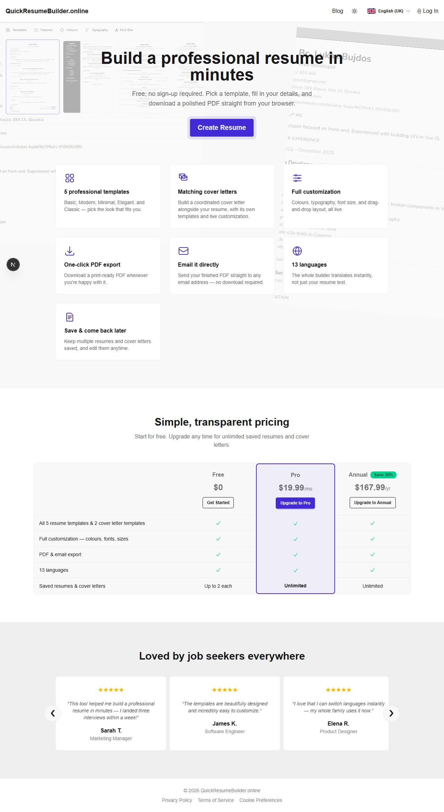
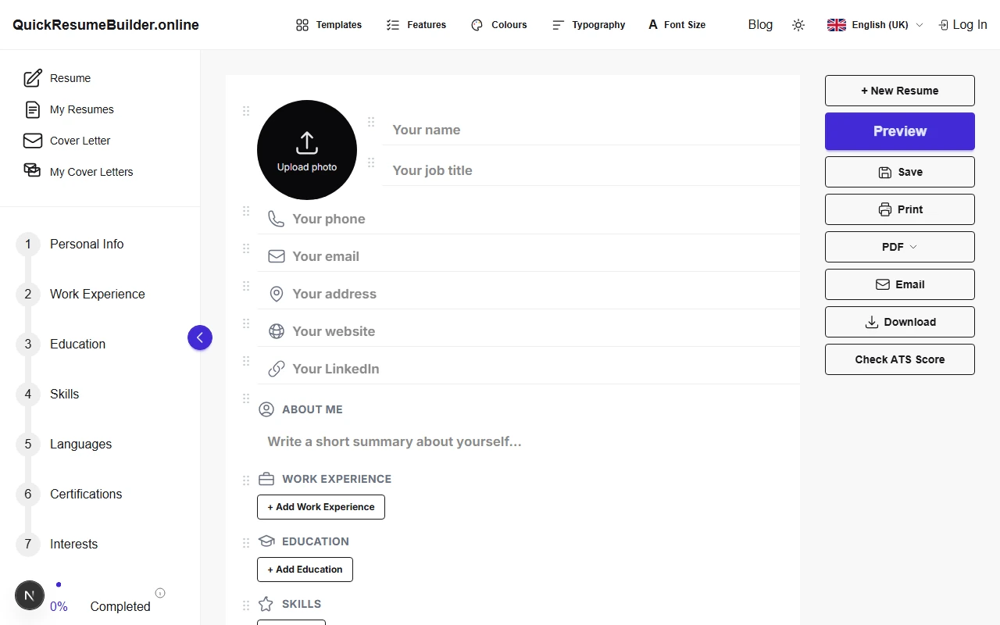
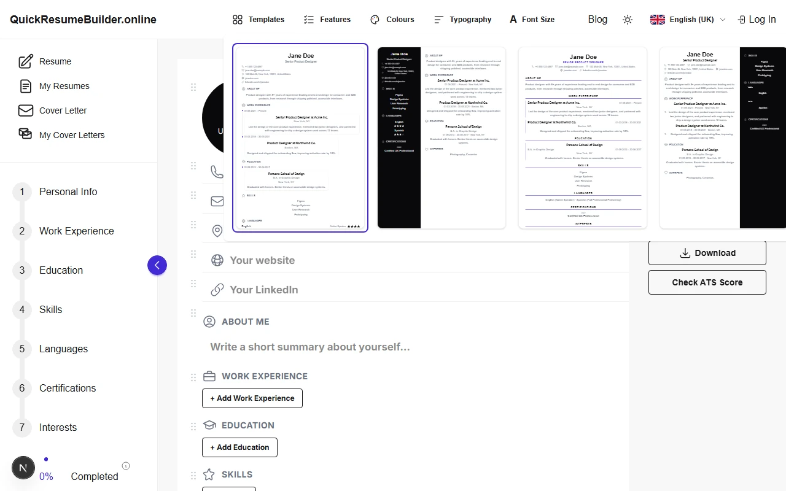

# QuickResumeBuilder.online

**Live:** [www.quickresumebuilder.online](https://www.quickresumebuilder.online)

A free, in-browser resume and cover letter builder built with Next.js. Fill in your details, see a live preview, and export to PDF, Word, or plain text — no account required, though logging in syncs your saved documents across devices.

|                                                    |                                                            |                                                              |
| -------------------------------------------------- | ---------------------------------------------------------- | ------------------------------------------------------------ |
|      |   |   |
| Landing page                                        | Resume builder editor                                      | Template picker                                               |

## Features

### Resume Builder
- **Five templates** — Basic, Modern, Minimal, Elegant, Classic (`/templates`).
- **Live drag-and-drop editing** — reorder fields, sections, and repeatable entries, with a touch-friendly mobile form (via [dnd-kit](https://dndkit.com/)).
- **Completion tracking** — a step list plus a radial progress indicator.
- **Save & manage** — 2 resumes free, unlimited on Pro/Annual, from `/my-resumes` (sortable, paginated, bulk-delete).
- **New Resume** resets the canvas without losing your template/colour/font choices.

### Cover Letter Builder
- **Two templates** — Basic and Modern (draggable sidebar/main sections, mirroring the resume Modern template).
- **Five draggable sections** — sender, recipient, date, subject, body.
- **Completion tracking** and **save & manage**, same pattern as the Resume Builder, via `/my-cover-letters`.

### Shared across both builders
- **Customization navbar** — accent colour, font, font size, field/section visibility.
- **Custom field** — one arbitrary value (e.g. Nationality, Driver's License) under a renameable section heading, reflected in the step tracker.
- **Export to PDF, Word, or plain text**, plus print and full-page preview.
- **Email export** — sends the exported file via [Resend](https://resend.com), hCaptcha-protected.
- **13 languages**, switchable on the fly (i18next).
- **ATS Checker** — a "Check ATS Score" button opens a format-parseability checklist, an optional keyword-match score against a pasted job description (deterministic, no LLM), and an optional AI coherence check (via Groq) that flags placeholder/gibberish content the deterministic checks can't catch. All scores are heuristic guides, not guarantees of real ATS behavior.

### Accounts & Authentication
- **Anonymous by default** — a silent Supabase session on first save, no sign-up needed.
- **Email/password or Google login** (`/login`) — email signup carries over your anonymous data; Google signup starts a fresh account.
- **Remember me** — unchecked, downgrades the session to browser-only.
- **Password reset** via `/reset-password`.
- **hCaptcha** on login, signup, and password reset.
- **Account page** (`/account`) — profile info, full data export, account deletion.

### Subscriptions & Billing
- **Free** ($0, 2 resumes + 2 cover letters), **Pro** ($19.99/mo), **Annual** ($167.99/yr) — Pro/Annual unlock the same unlimited saves, modeled in Stripe as one Product with two Prices.
- **Stripe Checkout** upgrade flow; requires a real (non-anonymous) account.
- **Free-tier limit prompt** — an upgrade dialog instead of a hard error, everywhere a save could happen.
- **Self-service billing** (`/billing`) — view plan, cancel/resume anytime.
- **Webhook-driven state** — the Stripe webhook is the only writer of subscription data, and sends a one-time welcome email on first subscribe.

### Support
- **Support page** (`/support`) — support email plus a live-chat button.
- **Tawk.to** widget, site-wide, opt-in via cookie consent.

### Privacy & feedback
- **Cookie consent** banner — necessary / analytics / support-chat categories.
- **Privacy Policy & Terms of Service** pages.
- **Toast notifications** — colour-coded by HTTP status (yellow 4xx, red 5xx), localized.

### Marketing site
- **Landing page** (`/`) — hero, feature grid, pricing table, testimonials.
- **Blog** (`/blog`) — Supabase-backed, admin-only posting, public reading.

### Role-based authorization
- **Admin role** via a JWT `app_metadata.role` claim, enforced at the database level (RLS), not just hidden in the UI.

### Security & monitoring
- **Security headers** — CSP, HSTS, X-Frame-Options, and friends, set in `next.config.ts` and scoped to the exact third-party origins the app loads (Supabase, hCaptcha, Tawk.to, Sentry).
- **Error monitoring** — Sentry, opt-in via `NEXT_PUBLIC_SENTRY_DSN`.

## Getting Started

```bash
cp .env.example .env.local
npm run dev
```

Open [http://localhost:3000](http://localhost:3000). Fill in your Supabase credentials at minimum — everything else below (Resend, Stripe, Tawk.to, hCaptcha, Upstash, Groq) is optional and fails gracefully when unset, so you can add it incrementally.

### Auth setup (Supabase Dashboard)
- **Google sign-in** — create an OAuth client in [Google Cloud Console](https://console.cloud.google.com/auth/clients/create), add the Client ID/Secret under **Authentication → Providers → Google**, and enable **manual linking** there too.
- **Redirect URLs** — under **Authentication → URL Configuration**, add both your local (`http://localhost:3000/auth/callback`) and production callback URLs, and set **Site URL** to your production domain.
- **Email delivery** — Supabase's built-in email is dev-only/rate-limited. For real emails, point custom SMTP (**Authentication → Emails → SMTP Settings**) at `smtp.resend.com` using your `RESEND_API_KEY`.

### Database setup (Supabase SQL Editor)
Run every file under `supabase/migrations/` in order (`0001`–`0006`) — there's no linked CLI project, so this isn't automatic. Then set `SUPABASE_SERVICE_ROLE_KEY` (Project Settings → API) — never expose this to the browser.

### Billing setup (Stripe)
1. Set `STRIPE_SECRET_KEY` in `.env.local`.
2. Run `node scripts/setup-stripe.mjs` — creates the Pro Product/Prices and prints `STRIPE_PRICE_ID_MONTHLY`/`STRIPE_PRICE_ID_ANNUAL`.
3. Run the [Stripe CLI](https://stripe.com/docs/stripe-cli) locally (`stripe listen --forward-to localhost:3000/api/stripe/webhook`) or add a production webhook endpoint listening for `checkout.session.completed`, `customer.subscription.updated`, `customer.subscription.deleted` — either way, set `STRIPE_WEBHOOK_SECRET`.
4. Add all Stripe vars in your host's environment settings too (e.g. Vercel project settings), not just `.env.local`.

### Support (Tawk.to)
Sign up at [tawk.to](https://www.tawk.to), create a property, and set `NEXT_PUBLIC_TAWKTO_PROPERTY_ID`/`NEXT_PUBLIC_TAWKTO_WIDGET_ID` from the embed snippet's URL.

### Error monitoring (Sentry)
Create a project at [sentry.io](https://sentry.io), set `NEXT_PUBLIC_SENTRY_DSN` to enable client/server error reporting, and `SENTRY_ORG`/`SENTRY_PROJECT`/`SENTRY_AUTH_TOKEN` to also upload source maps at build time. Unset = Sentry is never initialized, matching every other optional integration here.

### Blog admin setup
1. Run migration `0006` (see Database setup).
2. `node scripts/set-admin.mjs you@example.com` to grant yourself the admin role.
3. Log out and back in — the role only lands in your session on login/refresh.

### Bot protection (hCaptcha)
1. Sign up at [hCaptcha](https://www.hcaptcha.com), add your domain(s), and grab the **Site Key**/**Secret Key**.
2. Set `NEXT_PUBLIC_HCAPTCHA_SITE_KEY`.
3. In **Supabase Dashboard → Authentication → Attack Protection**, enable CAPTCHA protection with the same **Secret Key**.
4. Also set `HCAPTCHA_SECRET_KEY` — required separately because `/api/send-email` verifies it directly rather than through Supabase.

### Rate limiting (Upstash Redis)
Guards `/api/send-email`, `/api/account/export`/`delete`, and `/api/stripe/checkout`/`cancel` against abuse. Create a free database at [Upstash](https://upstash.com) and set `UPSTASH_REDIS_REST_URL`/`UPSTASH_REDIS_REST_TOKEN`. Unset = no limiting, not an error.

### AI coherence check (Groq)
Powers the ATS Checker's optional "Check Coherence" button. Sign up at [console.groq.com](https://console.groq.com) and set `GROQ_API_KEY`. Unset shows a clear "not configured" message instead of failing silently. Note: Groq's free tier (30 req/min, 14,400/day) is shared across your whole app, not per-user — fine for occasional use, worth watching under real traffic.

## Project Structure

- **`app/`** — Next.js App Router pages and API routes. Notable routes: `/app` (resume editor), `/cover-letter` (editor), `/my-resumes`/`/my-cover-letters` (saved lists), `/templates` (gallery), `/account`/`/billing`/`/support` (account pages), `/blog`, `/login`, `/reset-password`, `/privacy`/`/terms`. API routes mirror the features above (`/api/send-email`, `/api/stripe/*`, `/api/account/*`, `/api/ats-coherence`, `/api/blog`).
- **`components/`**
  - `resumes/`, `cover-letter/` — builder pages, editing canvases, and per-template `desktop-templates/`/`mobile-templates/`.
  - `pdf/` — `@react-pdf/renderer` templates, used by `DownloadButton.tsx`/`EmailButton.tsx`.
  - `navbar/` — customization dropdowns and `AuthButton.tsx`.
  - `landing-page/` — `LandingPage.tsx`, `PricingSection.tsx`.
  - `AtsCheckerDialog.tsx` — shared report dialog for both builders; scoring logic lives in `lib/atsChecker/`.
  - `Toast.tsx`, `CookieConsent.tsx`/`ConsentedAnalytics.tsx` — global providers mounted in `app/layout.tsx`.
  - Shared UI: `PreviewModal.tsx` (+ `ScaleToFit.tsx`), `SaveResumeDialog.tsx`, `ConfirmDialog.tsx`, `Sortable.tsx`, `Sidebar.tsx`, and other primitives reused by both builders.
- **`lib/`**
  - `resumeData.ts`/`coverLetterData.ts` — data types; `templates.ts`/`coverLetterTemplates.ts` — template registries.
  - `atsChecker/` — `checkResumeFormat.ts`/`checkCoverLetterFormat.ts` (format checklists), `matchKeywords.ts` (keyword matching), `checkCoherence.ts` (Groq call, server-only).
  - `apiResponse.ts`/`apiErrors.ts` — client/server halves of the localized, status-coded error/toast system.
  - `rateLimit.ts` — Upstash-backed rate limiter, fails open if unconfigured.
  - `constants.ts` — shared numeric constants (status codes, limits, timings).
  - `supabase/` — `client.ts`/`server.ts`/`proxy.ts` (client factories), `session.ts` (anonymous sessions), `invisibleCaptcha.ts`/`hcaptcha.ts`, `auth.ts`, `resumes.ts`/`coverLetters.ts`, `subscriptions.ts`, `blogPosts.ts`.
  - `email/` — Resend-backed senders, lazily instantiated like `stripe.ts`.
  - `text/`, `docx/`, `pdf/` — the three non-editor export renderers per document type.
- **`scripts/`** — `setup-stripe.mjs`, `set-admin.mjs` (one-time setup scripts, see Getting Started above).
- **`supabase/migrations/`** — numbered SQL migrations, applied manually.

## Available Scripts
- `npm run dev` — start the dev server (Turbopack).
- `npm run build` — production build.
- `npm run start` — run the production build.
- `npm run lint` — ESLint.

## Learn More
Built with Next.js 16, React 19, Tailwind CSS v4, and daisyUI 5. See the [Next.js Documentation](https://nextjs.org/docs) for framework details.
