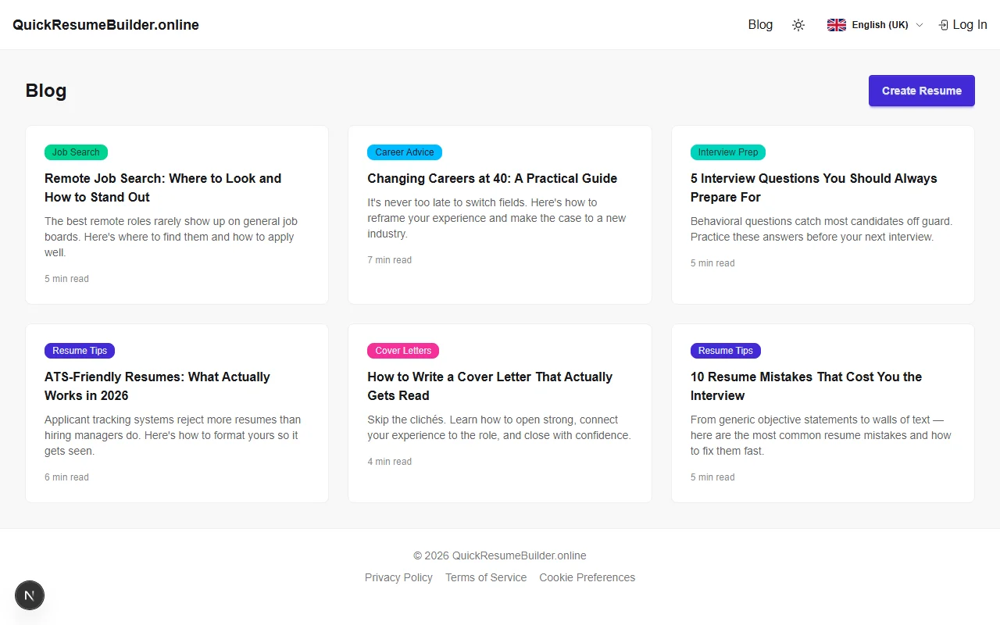
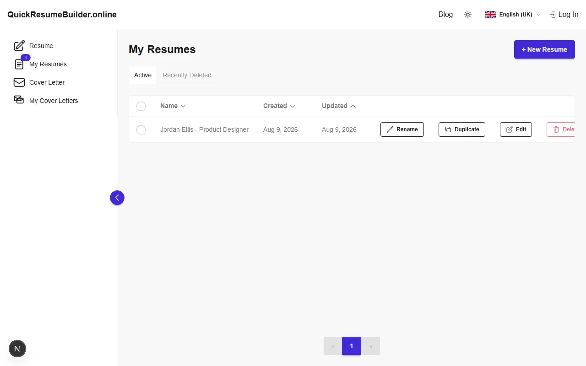
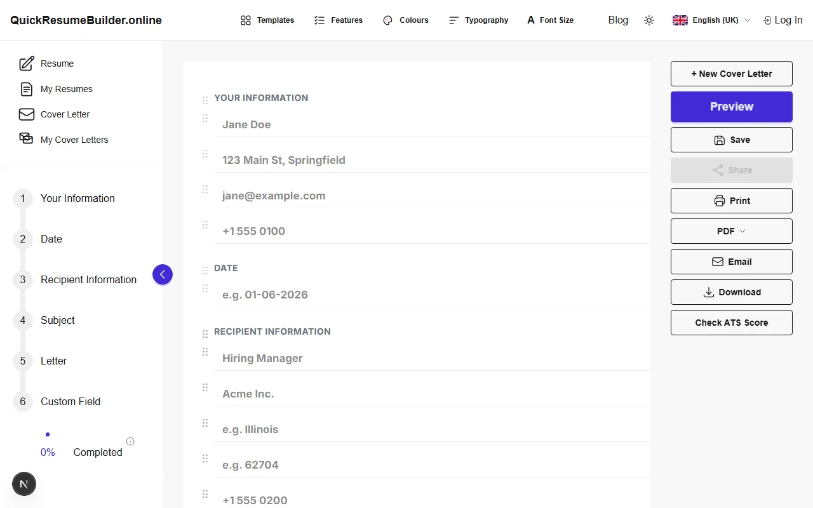

# QuickResumeBuilder.online

**Live:** [www.quickresumebuilder.online](https://www.quickresumebuilder.online)

A free, in-browser resume and cover letter builder. Fill in your details, see a live preview, and export to PDF, Word, or plain text — no account required, though logging in syncs your documents across devices.

|                                                    |                                                            |                                                              |
| -------------------------------------------------- | ---------------------------------------------------------- | ------------------------------------------------------------ |
|      |   |   |
| Landing page                                        | Resume builder editor                                      | Template picker                                               |
|                 |            |   |
| Blog                                                | My Resumes                                                  | Cover letter builder editor                                   |

## Features

- Resume builder (5 templates) and cover letter builder (2 templates), both with drag-and-drop sections, completion tracking, and save/restore/delete
- Customization: colour, font, size, field visibility, custom fields
- Export to PDF, Word, or plain text; print, email, and shareable links
- ATS Checker — format check, keyword match, and an AI coherence check (Groq)
- 13 languages
- Anonymous by default, or sign in with email/password or Google
- Stripe subscriptions (Free / Pro / Annual)
- Admin blog with role-based access and mandatory 2FA
- Security headers, Sentry error tracking, health checks, audit log

## Prerequisites
- [Node.js](https://nodejs.org) `>=24.19.0` (pinned in `.nvmrc` — run `nvm use`)
- npm, Git
- A [Supabase](https://supabase.com) project — the only required external service. Everything else (Resend, Stripe, Tawk.to, hCaptcha, Upstash, Groq) is optional and the app degrades gracefully without it.

## Getting Started

```bash
git clone https://github.com/bujdoluk/resume-builder.git
cd resume-builder
npm install
cp .env.example .env.local
npm run dev
```

Open [http://localhost:3000](http://localhost:3000), then fill in your Supabase credentials in `.env.local`. Add the optional integrations below as you need them.

**VS Code:** open `resume-builder.code-workspace` for recommended extensions and shared editor settings.

## Available Scripts
- `npm run dev` — dev server (Turbopack)
- `npm run build` / `npm run start` — production build / run it
- `npm run lint` — ESLint
- `npm run type-check` — `next typegen` (route types) then `tsc --noEmit`, without a full build
- `npm test` / `npm run test:run` — Vitest, watch / single run
- `npm run test:coverage` — Vitest with coverage report
- `npm run test:e2e` / `npm run test:e2e:headed` — Playwright, headless / visible
- `npm run db:types` — regenerate `lib/supabase/database.types.ts` (needs `supabase login`)
- `npm run analyze` — bundle analyzer; add `-- --output` for a static report

## Project Structure

```
.
├── app/                 # App Router — pages + API route handlers
│   ├── (app)/            # /app, /cover-letter, /my-resumes, /my-cover-letters, /templates
│   ├── api/               # account, admin, ai-rewrite, ats-coherence, blog, cron, health, send-email, stripe
│   └── shared/            # public shareable-link view + PDF streaming
├── components/          # one folder per feature area (resumes, cover-letter, pdf, navbar,
│                         # landing-page, ai-tools, share, blog, account, auth, sidebar, ...)
├── lib/
│   ├── resumeData.ts / coverLetterData.ts   # Zod schemas + schema versioning
│   ├── templates.ts / coverLetterTemplates.ts
│   ├── atsChecker/ aiRewrite/            # format checks, keyword matching, Groq calls
│   ├── adminAuth.ts / auditLog.ts        # admin gate, audit trail
│   ├── pdf/ docx/ text/                  # export renderers
│   ├── supabase/                         # typed clients + table wrappers
│   ├── i18n/                             # locales + i18next setup
│   └── constants.ts
├── __tests__/           # Vitest, mirrors the source tree
├── e2e/                 # Playwright user-journey tests
├── supabase/migrations/ # numbered SQL migrations
├── scripts/             # setup-stripe, set-admin, reset-admin-mfa, copy-pdf-worker
└── .github/workflows/   # dev, prod (checks → migrate → deploy), e2e, release, db-types-check
```

## Setup

### Auth (Supabase Dashboard)
- **Google sign-in** — create an OAuth client in [Google Cloud Console](https://console.cloud.google.com/auth/clients/create), add the Client ID/Secret under Authentication → Providers → Google, and enable manual linking.
- **Redirect URLs** — under Authentication → URL Configuration, add `http://localhost:3000/auth/callback` and your production callback, and set Site URL to your production domain.
- **Email delivery** — Supabase's built-in email is dev-only. For production, point custom SMTP (Authentication → Emails → SMTP Settings) at `smtp.resend.com` with your `RESEND_API_KEY`.

### Database (Supabase)
For a new project, run every file in `supabase/migrations/` in order via the SQL Editor to set up the schema. After that, CI handles it: `prod.yml` runs `supabase db push` against production on every push to `main`, before deploying. You'll need a `SUPABASE_DB_URL` repo secret — use the **Session pooler** connection string (not Direct, which is IPv6-only and fails on GitHub Actions runners; not Transaction pooler, which breaks some migration DDL) — plus `SUPABASE_SERVICE_ROLE_KEY`.

For local dev against an existing project: `npx supabase login`, then `npx supabase link --project-ref <ref>`. If the schema was already applied by hand, run `npx supabase migration repair --status applied <versions...>` first so the CLI's history matches reality.

After adding a migration, run `npm run db:types` to regenerate `lib/supabase/database.types.ts` — don't hand-edit it. CI (`db-types-check.yml`) fails the build if the committed file drifts from the live schema.

### Billing (Stripe)
1. Set `STRIPE_SECRET_KEY` in `.env.local`.
2. Run `node scripts/setup-stripe.mjs` to create the Pro Product/Prices and print `STRIPE_PRICE_ID_MONTHLY`/`STRIPE_PRICE_ID_ANNUAL`.
3. Forward webhooks locally with the [Stripe CLI](https://stripe.com/docs/stripe-cli) (`stripe listen --forward-to localhost:3000/api/stripe/webhook`), or add a production endpoint for `checkout.session.completed`, `customer.subscription.updated`, `customer.subscription.deleted`. Set `STRIPE_WEBHOOK_SECRET` either way.
4. Add the same Stripe env vars to your host (e.g. Vercel).

### Support (Tawk.to)
Create a property at [tawk.to](https://www.tawk.to) and set `NEXT_PUBLIC_TAWKTO_PROPERTY_ID`/`NEXT_PUBLIC_TAWKTO_WIDGET_ID` from the embed snippet.

### Error monitoring (Sentry)
Create a project at [sentry.io](https://sentry.io) and set `NEXT_PUBLIC_SENTRY_DSN`. Add `SENTRY_ORG`/`SENTRY_PROJECT`/`SENTRY_AUTH_TOKEN` to also upload source maps at build time.

### Blog admin
1. Run migration `0006`.
2. `node scripts/set-admin.mjs you@example.com` to grant yourself admin.
3. Log out and back in.
4. Enroll 2FA (below) — admin routes 403 until you do.

### Two-factor auth (admin)
1. In Supabase Dashboard → Authentication → MFA, make sure TOTP is enabled.
2. As the admin, go to `/account` and enroll under "Two-Factor Authentication" — scan the QR code with an authenticator app and confirm the code.
3. From then on, both password and Google login prompt for a code before reaching admin pages.
4. Lost the device? `node scripts/reset-admin-mfa.mjs you@example.com` clears the factor without touching the admin role.

### Bot protection (hCaptcha)
1. Sign up at [hCaptcha](https://www.hcaptcha.com), add your domain, get the Site Key/Secret Key.
2. Set `NEXT_PUBLIC_HCAPTCHA_SITE_KEY` and `HCAPTCHA_SECRET_KEY`.
3. Enable CAPTCHA protection in Supabase Dashboard → Authentication → Attack Protection with the same Secret Key.

### Rate limiting (Upstash Redis)
Create a free database at [Upstash](https://upstash.com) and set `UPSTASH_REDIS_REST_URL`/`UPSTASH_REDIS_REST_TOKEN`. Guards email/account/billing/AI endpoints; without it, those routes just aren't rate-limited.

### AI features (Groq)
Powers the ATS Checker's coherence check and "Rewrite with AI". Sign up at [console.groq.com](https://console.groq.com) and set `GROQ_API_KEY`. Note the free tier (30 req/min, 14,400/day) is shared across the whole app.

### Scheduled cleanup
A daily Vercel Cron Job (`vercel.json`) hits `/api/cron/cleanup-anonymous-users` to delete abandoned anonymous accounts after `ANONYMOUS_ACCOUNT_RETENTION_DAYS` (7 by default, `lib/constants.ts`). Set `CRON_SECRET` in Vercel's env vars — Vercel attaches it automatically as a bearer token.

### Production deploys
`prod.yml`'s `deploy` job runs `vercel deploy --prod` after migrations succeed, rather than relying on Vercel's own git integration (disabled via Ignored Build Step → `exit 0`), so a failing migration blocks the deploy. Needs `VERCEL_TOKEN`, `VERCEL_ORG_ID`, `VERCEL_PROJECT_ID` as repo secrets.

## Testing

Unit tests use [Vitest](https://vitest.dev) and live under `__tests__/`, mirroring the source tree. `npm test` (watch), `npm run test:run` (single run, what CI uses), `npm run test:coverage` (with a v8 report). Coverage isn't gated in CI — this project focuses on the critical path (API routes, auth/admin gates, export generation, ATS scoring, rate limiting) rather than 100%.

End-to-end tests use [Playwright](https://playwright.dev) under `e2e/`, driving full anonymous-user journeys through both builders. `npm run test:e2e` (headless) / `npm run test:e2e:headed` (visible browser). First run `npx playwright install chromium`. Runs in CI on every push/PR to `main`.

Some UI is E2E-only rather than unit-tested by design: Vitest doesn't support async Server Components, so pages built around them (most of the app shell beyond the two builders) are covered end-to-end instead.

A pre-commit hook (Husky + lint-staged) runs `eslint --fix` on staged files — it doesn't catch type errors or test failures, so CI still checks those.

## Updating Dependencies

Versions are pinned exactly (no `^`/`~`), so `npm update` won't move most packages — edit `package.json` directly. A few foundational devDependencies (`typescript`, `eslint`, `tailwindcss`, etc.) use a bare major version and pick up patches automatically.

Recommended flow: bump patch/minor versions together, handle each major-version bump separately with its own changelog check, and run `npx tsc --noEmit -p .`, `npm run lint`, `npm run test:run`, `npm run test:e2e` after each change. Since this repo runs a modified/future version of Next.js (see `AGENTS.md`), don't assume standard upgrade behavior — check `node_modules/<package>/dist/docs` first.

Deferred major bumps: `typescript` 5→7, `eslint` 9→10, `apexcharts` 5→6.

To bump Next.js itself (and keep `eslint-config-next` in step), use `npx next upgrade` rather than hand-editing the pin.

## Releases

Deploys are automatic on every push to `main`; releases are just about tagging what's live. [`release-please`](https://github.com/googleapis/release-please) watches commits (which follow [Conventional Commits](https://www.conventionalcommits.org)) and keeps a standing "chore: release X.Y.Z" PR up to date. Merging that PR cuts the tag and GitHub Release.

`fix:` → patch, `feat:` → minor, anything with `!` or a `BREAKING CHANGE:` footer → major (this repo is pre-1.0, so a breaking change currently jumps straight to `1.0.0`). Other commit types (`refactor:`, `ci:`, `test:`, `chore:`, `docs:`) don't trigger a release on their own.

Manual fallback if the Action is down:
```bash
git checkout main && git pull
git log $(git describe --tags --abbrev=0)..HEAD --oneline
npm version patch   # or minor / major
git push && git push --tags
gh release create $(git describe --tags --abbrev=0) --generate-notes
```
Then update `.release-manifest.json` to match, or the next automated run works off a stale baseline.

## Learn More
Built with Next.js 16, React 19, Tailwind CSS v4, and daisyUI 5. See the [Next.js Documentation](https://nextjs.org/docs) for framework details.
