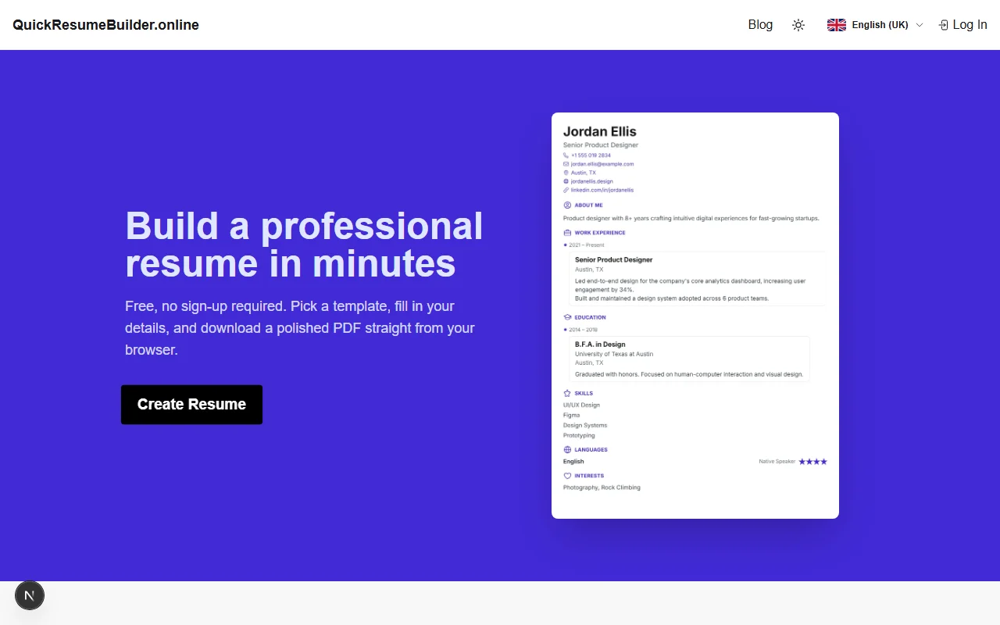
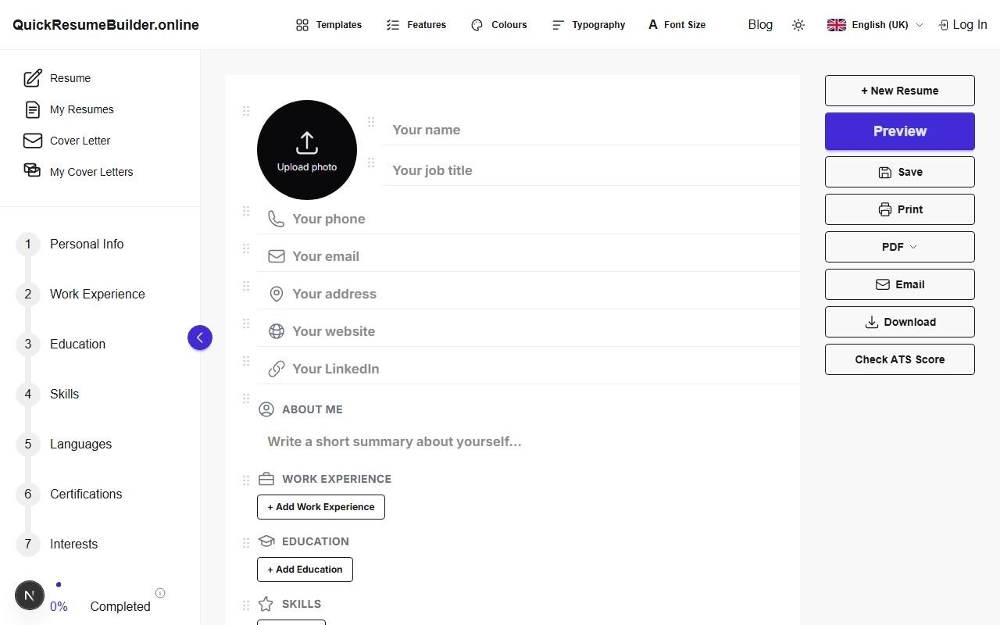
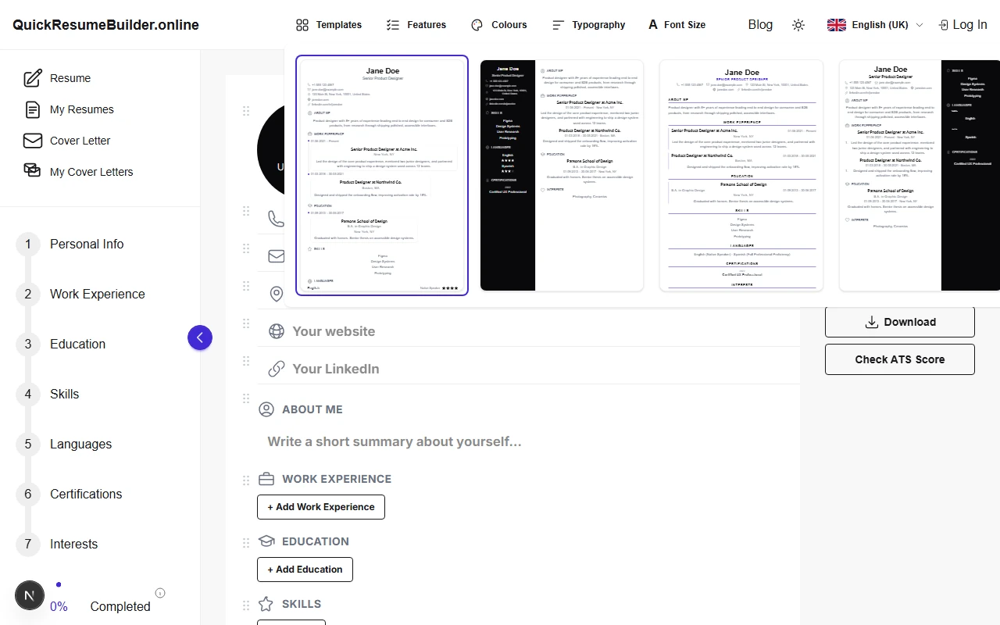

# QuickResumeBuilder.online

**Live:** [www.quickresumebuilder.online](https://www.quickresumebuilder.online)

A free, in-browser resume and cover letter builder built with Next.js. Fill in your details, see a live preview, and export to PDF, Word, or plain text — no account required, though logging in syncs your saved documents across devices.

|                                                    |                                                            |                                                              |
| -------------------------------------------------- | ---------------------------------------------------------- | ------------------------------------------------------------ |
|      |   |   |
| Landing page                                        | Resume builder editor                                      | Template picker                                               |

## Features

### Resume Builder
- **Five templates** — Basic, Modern, Minimal, Elegant, Classic (`/templates`).
- **Live drag-and-drop editing** — reorder fields, sections, and repeatable entries, with a touch-friendly mobile form (via [dnd-kit](https://dndkit.com/)).
- **Completion tracking** — a step list plus a radial progress indicator.
- **Save & manage** — 2 resumes free, unlimited on Pro/Annual, from `/my-resumes` (sortable, paginated, bulk-delete).
- **New Resume** resets the canvas without losing your template/colour/font choices.

### Cover Letter Builder
- **Two templates** — Basic and Modern (draggable sidebar/main sections, mirroring the resume Modern template).
- **Five draggable sections** — sender, recipient, date, subject, body.
- **Completion tracking** and **save & manage**, same pattern as the Resume Builder, via `/my-cover-letters`.

### Shared across both builders
- **Customization navbar** — accent colour, font, font size, field/section visibility.
- **Custom field** — one arbitrary value (e.g. Nationality, Driver's License) under a renameable section heading, reflected in the step tracker.
- **Export to PDF, Word, or plain text**, plus print and full-page preview.
- **Email export** — sends the exported file via [Resend](https://resend.com), hCaptcha-protected.
- **Shareable links** — generate a public, unauthenticated link (random token, 30-day expiration) that renders the document's PDF for anyone who has it; revocable anytime.
- **13 languages**, switchable on the fly (i18next).
- **ATS Checker** — a "Check ATS Score" button opens a format-parseability checklist, an optional keyword-match score against a pasted job description (deterministic, no LLM), and an optional AI coherence check (via Groq) that flags placeholder/gibberish content the deterministic checks can't catch. All scores are heuristic guides, not guarantees of real ATS behavior.

### Accounts & Authentication
- **Anonymous by default** — a silent Supabase session on first save, no sign-up needed.
- **Email/password or Google login** (`/login`) — email signup carries over your anonymous data; Google signup starts a fresh account.
- **Remember me** — unchecked, downgrades the session to browser-only.
- **Password reset** via `/reset-password`.
- **hCaptcha** on login, signup, and password reset.
- **Account page** (`/account`) — profile info, full data export, account deletion.

### Subscriptions & Billing
- **Free** ($0, 2 resumes + 2 cover letters), **Pro** ($19.99/mo), **Annual** ($167.99/yr) — Pro/Annual unlock the same unlimited saves, modeled in Stripe as one Product with two Prices.
- **Stripe Checkout** upgrade flow; requires a real (non-anonymous) account.
- **Free-tier limit prompt** — an upgrade dialog instead of a hard error, everywhere a save could happen.
- **Self-service billing** (`/billing`) — view plan, cancel/resume anytime.
- **Webhook-driven state** — the Stripe webhook is the only writer of subscription data, and sends a one-time welcome email on first subscribe.

### Support
- **Support page** (`/support`) — support email plus a live-chat button.
- **Tawk.to** widget, site-wide, opt-in via cookie consent.

### Privacy & feedback
- **Cookie consent** banner — necessary / analytics / support-chat categories.
- **Privacy Policy & Terms of Service** pages.
- **Toast notifications** — colour-coded by HTTP status (yellow 4xx, red 5xx), localized.

### Marketing site
- **Landing page** (`/`) — hero, feature grid, pricing table, testimonials.
- **Blog** (`/blog`) — Supabase-backed, admin-only posting, public reading.

### Role-based authorization
- **Admin role** via a JWT `app_metadata.role` claim, enforced at the database level (RLS), not just hidden in the UI. Gates both blog post creation and the config-health endpoint below.
- **Mandatory 2FA for admins** — a TOTP factor (via Supabase Auth MFA) is required to actually reach admin-gated routes, not just the role claim; a compromised password alone isn't enough. Enrolled from `/account`; enforced server-side (`lib/adminAuth.ts`) via the session's Authenticator Assurance Level, with a step-up code prompt on login (password or Google) whenever a verified factor exists. Recovery for a lost device: `scripts/reset-admin-mfa.mjs`.

### Security & monitoring
- **Security headers** — CSP, HSTS, X-Frame-Options, and friends, built in `lib/securityHeaders.ts` (unit-tested) and applied in `next.config.ts`, scoped to the exact third-party origins the app loads (Supabase, hCaptcha, Tawk.to, Sentry).
- **Error monitoring** — Sentry, opt-in via `NEXT_PUBLIC_SENTRY_DSN`.
- **Config health check** (`/api/admin/config-health`, admin-only) — reports which optional integrations (rate limiting, hCaptcha, Groq, Stripe, Resend, Sentry) are actually configured, as booleans only, never secret values. Several of these fail open by design when unconfigured (see below), so this is the way to notice a missing production env var before it's discovered via abuse.
- **Health check** (`/api/health`, public) — lightweight liveness endpoint (`{ status: "ok", timestamp }`, `Cache-Control: no-store`, no auth) for external uptime monitors. Unlike the config-health endpoint above, it doesn't check any integration, it only confirms the app is up and responding.
- **Dependency vulnerability scanning** — `npm audit --audit-level=high` runs in CI on every push/PR, failing the build on high/critical vulnerabilities.
- **Automatic cleanup of abandoned anonymous accounts** — a daily cron job deletes anonymous sessions (and their resumes/cover letters) that were never converted into a real account after 7 days, matching the retention policy in the Privacy Policy.

## Getting Started

Requires Node.js `>=24.19.0` (pinned in `.nvmrc`/`package.json`'s `engines` — run `nvm use` if you use nvm).

```bash
cp .env.example .env.local
npm run dev
```

Open [http://localhost:3000](http://localhost:3000). Fill in your Supabase credentials at minimum — everything else below (Resend, Stripe, Tawk.to, hCaptcha, Upstash, Groq) is optional and fails gracefully when unset, so you can add it incrementally.

**Editor setup (optional):** open `resume-builder.code-workspace` in VS Code (**File → Open Workspace from File…**) for the project's recommended extensions and shared editor settings (2-space/LF/trim-whitespace to match `.editorconfig`, ESLint fix-on-save, the workspace's own pinned TypeScript version).

### Auth setup (Supabase Dashboard)
- **Google sign-in** — create an OAuth client in [Google Cloud Console](https://console.cloud.google.com/auth/clients/create), add the Client ID/Secret under **Authentication → Providers → Google**, and enable **manual linking** there too.
- **Redirect URLs** — under **Authentication → URL Configuration**, add both your local (`http://localhost:3000/auth/callback`) and production callback URLs, and set **Site URL** to your production domain.
- **Email delivery** — Supabase's built-in email is dev-only/rate-limited. For real emails, point custom SMTP (**Authentication → Emails → SMTP Settings**) at `smtp.resend.com` using your `RESEND_API_KEY`.

### Database setup (Supabase)
For a brand-new project, run every file under `supabase/migrations/` in order (`0001`–`0013`) once via the Supabase SQL Editor to establish the baseline schema. From then on, new migrations apply themselves: `.github/workflows/prod.yml`'s `migrate` job runs `supabase db push` against production on every push to `main`, *before* the `deploy` job runs — a failing migration blocks the deploy instead of shipping code the schema doesn't support yet. This needs a `SUPABASE_DB_URL` **repository secret** (Settings → Secrets and variables → Actions) — the project's **Session pooler** Postgres connection string from Project Settings → Database → Connection string → URI (username `postgres.<project-ref>`, port `5432`). Not the Direct connection — GitHub Actions runners have no outbound IPv6, and Supabase's direct-connection host is IPv6-only, so it fails with `ECONNREFUSED` from CI. Not the Transaction pooler either — its statement caching breaks some DDL patterns migrations need. Then set `SUPABASE_SERVICE_ROLE_KEY` (Project Settings → API) — never expose this to the browser.

For local development against an existing project (or to adopt CI-driven migrations on a project whose schema was previously applied by hand), link the CLI once: `npx supabase login` (opens a browser, needs a [personal access token](https://supabase.com/dashboard/account/tokens)) then `npx supabase link --project-ref <ref>`. If the database already has migrations applied outside the CLI, run `npx supabase migration repair --status applied <versions...>` to mark them applied in Supabase's remote history table *without* re-running their SQL, then confirm with `npx supabase migration list` that nothing is pending before relying on `db push`.

After adding a migration, regenerate `lib/supabase/database.types.ts` so the app's TypeScript types stay in sync with the real schema: `npm run db:types` (uses the same CLI login as above). This overwrites the file with the CLI's real generated output, so don't hand-edit it — if the CLI login isn't available, hand-editing to match the migration SQL is the fallback, but the generated version is authoritative when you have it.

`.github/workflows/db-types-check.yml` enforces this in CI — it regenerates the types and fails the build if they differ from what's committed (on push/PR touching `supabase/migrations/**` or the types file itself, plus a weekly cron to catch schema changes made directly in the Dashboard SQL Editor with no matching commit). It needs a `SUPABASE_ACCESS_TOKEN` **repository secret** (Settings → Secrets and variables → Actions) — a personal access token, same as the local login above, just stored for CI instead of on a developer's machine.

### Billing setup (Stripe)
1. Set `STRIPE_SECRET_KEY` in `.env.local`.
2. Run `node scripts/setup-stripe.mjs` — creates the Pro Product/Prices and prints `STRIPE_PRICE_ID_MONTHLY`/`STRIPE_PRICE_ID_ANNUAL`.
3. Run the [Stripe CLI](https://stripe.com/docs/stripe-cli) locally (`stripe listen --forward-to localhost:3000/api/stripe/webhook`) or add a production webhook endpoint listening for `checkout.session.completed`, `customer.subscription.updated`, `customer.subscription.deleted` — either way, set `STRIPE_WEBHOOK_SECRET`.
4. Add all Stripe vars in your host's environment settings too (e.g. Vercel project settings), not just `.env.local`.

### Support (Tawk.to)
Sign up at [tawk.to](https://www.tawk.to), create a property, and set `NEXT_PUBLIC_TAWKTO_PROPERTY_ID`/`NEXT_PUBLIC_TAWKTO_WIDGET_ID` from the embed snippet's URL.

### Error monitoring (Sentry)
Create a project at [sentry.io](https://sentry.io), set `NEXT_PUBLIC_SENTRY_DSN` to enable client/server error reporting, and `SENTRY_ORG`/`SENTRY_PROJECT`/`SENTRY_AUTH_TOKEN` to also upload source maps at build time. Unset = Sentry is never initialized, matching every other optional integration here.

### Blog admin setup
1. Run migration `0006` (see Database setup).
2. `node scripts/set-admin.mjs you@example.com` to grant yourself the admin role.
3. Log out and back in — the role only lands in your session on login/refresh.
4. Enroll two-factor authentication (see below) — admin routes 403 until you do.

### Two-factor authentication (Admin)
Admin routes require a completed 2FA challenge, not just the role claim (see Role-based authorization above).
1. In **Supabase Dashboard → Authentication → Multi-Factor Authentication**, make sure TOTP is enabled — enrollment fails otherwise.
2. Log in as the admin account, go to `/account`, and enroll under "Two-Factor Authentication" (an authenticator app like Google Authenticator, Microsoft Authenticator, Authy, or 1Password is required — scan the QR code or paste the setup key manually, then confirm with the 6-digit code it generates).
3. From then on, both password and Google login prompt for a fresh code from that app before reaching admin-gated pages.
4. Lost the device? `node scripts/reset-admin-mfa.mjs you@example.com` clears the factor (via service role) so you can re-enroll; it does not touch the admin role itself.

### Bot protection (hCaptcha)
1. Sign up at [hCaptcha](https://www.hcaptcha.com), add your domain(s), and grab the **Site Key**/**Secret Key**.
2. Set `NEXT_PUBLIC_HCAPTCHA_SITE_KEY`.
3. In **Supabase Dashboard → Authentication → Attack Protection**, enable CAPTCHA protection with the same **Secret Key**.
4. Also set `HCAPTCHA_SECRET_KEY` — required separately because `/api/send-email` verifies it directly rather than through Supabase.

### Rate limiting (Upstash Redis)
Guards `/api/send-email`, `/api/account/export`/`delete`, `/api/stripe/checkout`/`cancel`, and the Groq-backed `/api/ats-coherence`/`/api/ai-rewrite` against abuse. Create a free database at [Upstash](https://upstash.com) and set `UPSTASH_REDIS_REST_URL`/`UPSTASH_REDIS_REST_TOKEN`. Unset = no limiting, not an error.

### AI features (Groq)
Powers the ATS Checker's optional "Check Coherence" button and the "Rewrite with AI" button on resume/cover letter text fields. Sign up at [console.groq.com](https://console.groq.com) and set `GROQ_API_KEY`. Unset shows a clear "not configured" message instead of failing silently. Note: Groq's free tier (30 req/min, 14,400/day) is shared across your whole app, not per-user — fine for occasional use, worth watching under real traffic.

### Scheduled cleanup (Cron)
A daily [Vercel Cron Job](https://vercel.com/docs/cron-jobs) (configured in `vercel.json`) calls `/api/cron/cleanup-anonymous-users` to delete anonymous accounts older than `ANONYMOUS_ACCOUNT_RETENTION_DAYS` (`lib/constants.ts`, currently 7 days) that were never converted into a real account. Generate a random secret and set it as `CRON_SECRET` in your Vercel project's environment variables — Vercel then calls the endpoint on schedule and attaches it automatically as an `Authorization: Bearer` header, which the route requires (unlike this app's other optional integrations, it fails closed, not open, if unset — an unauthenticated request to this endpoint is rejected outright rather than silently skipped).

### Production deploys (Vercel, via CI)
Production deploys are triggered by `.github/workflows/prod.yml`'s `deploy` job, not by Vercel's git integration directly — that's deliberate: it lets the `migrate` job (see "Database setup" above) run first and block the deploy if it fails. Vercel's own git-triggered auto-deploy for `main` is disabled: Project Settings → Git → **Ignored Build Step** → `exit 0`, which makes Vercel always skip its own build and rely solely on the explicit `vercel deploy --prod` call from Actions. Three **repository secrets** are needed for that job: `VERCEL_TOKEN` (Vercel Dashboard → Account Settings → Tokens), and `VERCEL_ORG_ID`/`VERCEL_PROJECT_ID` (both readable from a local `vercel link`'s gitignored `.vercel/project.json`, or the project's Settings → General page).

## Project Structure

- **`app/`** — Next.js App Router pages and API routes. Notable routes: `/app` (resume editor), `/cover-letter` (editor), `/my-resumes`/`/my-cover-letters` (saved lists), `/templates` (gallery), `/account`/`/billing`/`/support` (account pages), `/blog`, `/login`, `/reset-password`, `/privacy`/`/terms`, `/shared/resume/[token]`/`/shared/cover-letter/[token]` (public shared-link view + its `pdf/route.tsx` sibling). API routes mirror the features above (`/api/send-email`, `/api/stripe/*`, `/api/account/*`, `/api/ats-coherence`, `/api/ai-rewrite`, `/api/blog`, `/api/admin/config-health`, `/api/cron/*`).
- **`components/`**
  - `resumes/`, `cover-letter/` — builder pages, editing canvases, and per-template `desktop-templates/`/`mobile-templates/`.
  - `pdf/` — `@react-pdf/renderer` templates, used by `DownloadButton.tsx`/`EmailButton.tsx`/the shared-link PDF routes.
  - `navbar/` — customization dropdowns and `AuthButton.tsx`.
  - `landing-page/` — `LandingPage.tsx`, `PricingSection.tsx`.
  - `AtsCheckerDialog.tsx` — shared report dialog for both builders; scoring logic lives in `lib/atsChecker/`.
  - `ShareDialog.tsx`/`SharedDocumentView.tsx` — create/revoke a shareable link from either builder; render its PDF (via `pdfjs-dist` canvas rendering, for mobile-browser compatibility) on the public `/shared/*` page.
  - `Toast.tsx`, `CookieConsent.tsx`/`ConsentedAnalytics.tsx` — global providers mounted in `app/layout.tsx`.
  - Shared UI: `PreviewModal.tsx` (+ `ScaleToFit.tsx`), `SaveResumeDialog.tsx`, `ConfirmDialog.tsx`, `Sortable.tsx`, `Sidebar.tsx`, and other primitives reused by both builders.
  - `AccountPage.tsx` — includes the admin-only Two-Factor Authentication enrollment section; `LoginPage.tsx` includes the post-login 2FA step-up prompt.
- **`lib/`**
  - `resumeData.ts`/`coverLetterData.ts` — data types; `templates.ts`/`coverLetterTemplates.ts` — template registries.
  - `atsChecker/` — `checkResumeFormat.ts`/`checkCoverLetterFormat.ts` (format checklists), `matchKeywords.ts` (keyword matching), `checkCoherence.ts` (Groq call, server-only).
  - `apiResponse.ts`/`apiErrors.ts` — client/server halves of the localized, status-coded error/toast system.
  - `adminAuth.ts` — `requireAdmin()`, the shared server-side gate (role + 2FA) for admin-only routes.
  - `shareLink.ts` — `isShareLinkActive()`, expiry check shared by both builders' shareable-link UI.
  - `rateLimit.ts` — Upstash-backed rate limiter, fails open if unconfigured.
  - `securityHeaders.ts` — CSP/security-header construction, imported by `next.config.ts`; kept as a separate module specifically so it's unit-testable.
  - `configHealth.ts` — boolean-only report of which optional integrations are configured, backing `/api/admin/config-health`.
  - `constants.ts` — shared numeric constants (status codes, limits, timings).
  - `supabase/` — `client.ts`/`server.ts`/`proxy.ts` (client factories), `serviceRole.ts` (server-only, bypasses RLS), `session.ts` (anonymous sessions), `invisibleCaptcha.ts`/`hcaptcha.ts`, `auth.ts` (incl. TOTP enroll/verify/step-up), `resumes.ts`/`coverLetters.ts` (incl. share-token issuing/lookup), `subscriptions.ts`, `blogPosts.ts`.
  - `email/` — Resend-backed senders, lazily instantiated like `stripe.ts`.
  - `text/`, `docx/`, `pdf/` — the three non-editor export renderers per document type; `pdf/streamToBuffer.ts` drains `@react-pdf/renderer`'s stream output for the shared-link PDF routes.
  - `i18n/i18nCore.ts` — a React-free i18next instance used by the PDF templates, since they're reachable from Route Handlers where the React-bound `i18n.ts` instance can't be imported; kept in sync with the app-wide instance in `AppState.tsx`.
- **`__tests__/`** — Vitest tests, mirroring the source tree (see Testing below).
- **`scripts/`** — `setup-stripe.mjs`, `set-admin.mjs`, `reset-admin-mfa.mjs` (one-time/recovery setup scripts, see Getting Started above), `copy-pdf-worker.mjs` (runs on every `npm install` via `postinstall`, copies the `pdfjs-dist` worker into `public/`).
- **`resume-builder.code-workspace`** — shared VS Code workspace file: recommended extensions + editor settings matching `.editorconfig`. Open via **File → Open Workspace from File…**.
- **`supabase/migrations/`** — numbered SQL migrations, applied to production by `prod.yml`'s `migrate` job.

## Testing
Unit tests use [Vitest](https://vitest.dev), set up per the [official Next.js guide](https://nextjs.org/docs/app/guides/testing/vitest). Test files live under `__tests__/`, mirroring the source tree (e.g. `__tests__/lib/color.test.ts` tests `lib/color.ts`). `npm test` runs in watch mode; `npm run test:run` runs once (what CI uses); `npm run test:coverage` runs once with a v8 coverage report (text summary in the terminal, plus HTML/lcov under `coverage/`, gitignored). Coverage isn't gated in CI — the project deliberately doesn't chase 100% (see below), so a percentage alone isn't a useful pass/fail signal here.

Coverage focuses on the critical path rather than chasing 100%: every `app/api/**/route.ts` handler (auth/anonymous/rate-limit guards, Stripe billing, role+2FA admin authorization, input validation) including the public shared-link PDF routes, the Supabase save/load mapping layer (incl. share-token issuing and expiry), PDF/DOCX/plain-text export generation, the ATS Checker's format-check scoring, rate limiting, i18n locale key parity, and CSP/security-header construction — plus two full-form component tests (`ResumeBuilder`/`CoverLetterBuilder`) that fill every field and exercise the real save flow end to end. Not covered: the session-refresh proxy (`proxy.ts`), and most UI beyond the two builders (templates gallery, account/billing pages, blog admin UI, the 2FA enrollment flow, the login step-up flow) — those remain a manual/E2E concern.

End-to-end tests use [Playwright](https://playwright.dev) and live under `e2e/` — `anonymous-resume-flow.spec.ts` and `anonymous-cover-letter-flow.spec.ts` each drive a full anonymous-user journey (landing page or direct navigation → builder → fill every section → save → assert the saved-document URL). `npm run test:e2e` runs headless and auto-starts the dev server on `http://localhost:3000` if it isn't already running; `npm run test:e2e:headed` runs the same tests in a visible browser window so you can watch each step. First-time setup needs the browser binary once: `npx playwright install chromium`.

`.github/workflows/e2e.yml` runs these on every push/PR to `main`, against the same Supabase project as production (the anonymous accounts each run creates are exactly what the retention cron cleans up) — Chromium is cached between runs keyed on `package-lock.json`, and a trace is uploaded as a build artifact on failure for debugging.

### Pre-commit hook
[Husky](https://typicode.github.io/husky) + [lint-staged](https://github.com/lint-staged/lint-staged) run `eslint --fix` on staged `.js`/`.jsx`/`.mjs`/`.ts`/`.tsx` files before each commit (config: `.husky/pre-commit`, `lint-staged` key in `package.json`). This only catches lint issues, not type errors or test failures — those still surface in CI (`npx tsc --noEmit -p .`, `npm run test:run`), so a clean local commit isn't a substitute for waiting on CI. The hook installs itself automatically via the `prepare` script on `npm install`; if it's ever skipped (e.g. `git commit --no-verify`), just re-run `npm install` or `npx husky` to reinstall it.

## Updating Dependencies
This repo pins **exact** versions for `dependencies` (no `^`/`~`) so installs are reproducible — `npm outdated`/`npm update` behave differently here than in a typically `^`-ranged project (`npm update` only moves a package within its declared range, so an exact-pinned package needs its `package.json` entry edited directly). A handful of foundational `devDependencies` (`@types/node`, `@types/react`, `@types/react-dom`, `eslint`, `tailwindcss`, `@tailwindcss/postcss`, `typescript`) intentionally use a bare major-version string instead (e.g. `"24"` not `"24.9.2"`) so they auto-pick-up patch/minor releases on a plain `npm install`, but still require an explicit edit to cross a major version.

**Node.js version** is pinned via `"engines"` in `package.json` and `.nvmrc` — both must stay in sync with what `.github/workflows/dev.yml`/`prod.yml`/`e2e.yml` run (`actions/setup-node` `node-version`) and with the Node.js version configured in the Vercel project settings (Dashboard → Settings → Node.js Version), since that last one isn't visible from the repo.

**Recommended process for future updates** (don't big-bang everything at once):
1. Run `npm outdated` and split the results into two buckets: patch/minor bumps (low risk) and major-version bumps (real breaking-change risk).
2. Update the patch/minor batch together — edit exact-pinned versions directly in `package.json`, then run `npm install` once (this also refreshes the bare-major-pinned packages to their latest compatible patch).
3. Handle each major-version bump as its own separate pass with its own research (read the package's own changelog/release notes — see the note below) and its own verification cycle, not bundled with the safe batch.
4. After each stage, run the full verification checklist: `npx next typegen`, `npx tsc --noEmit -p .`, `npm run lint`, `npm run test:run`, `npm run test:e2e`, then a manual smoke check (start the dev server, load the landing page and builder, watch for console errors).
5. If the Node.js version itself changes, update `engines` in `package.json`, `.nvmrc`, and both GitHub Actions workflows together, and flag the Vercel project settings for a manual update.

**Deferred major-version bumps** (available but not yet done — each needs its own pass per the process above):
- `typescript` 5 → 7 (skips a full major generation; expect newly-enforced strictness across the codebase)
- `eslint` 9 → 10 (flat config should mostly carry over, but `eslint-config-next` and any other plugins need a compatibility check first)
- `apexcharts` 5 → 6 (check whether `react-apexcharts` needs a matching bump; used for chart rendering, so needs a visual check, not just a type check)

**This repo specifically**: because this is a modified/future version of Next.js and its ecosystem (see the warning at the top of `AGENTS.md`), don't assume standard upstream upgrade behavior even for a minor-version bump — check `node_modules/<package>/dist/docs` or the package's own CHANGELOG first. This isn't theoretical: this session alone found real, undocumented-to-training-data differences (CSP/proxy handling, and `next dev` auto-regenerating part of `AGENTS.md` on Next.js 16.3+).

## Releases
Deployment already happens automatically on every push to `main` (see "Production deploys (Vercel, via CI)" above) — releases are just about getting a human-readable changelog and a tagged reference point for what's actually live at any given time.

**Automated (default)**: [`release-please`](https://github.com/googleapis/release-please) (`.github/workflows/release.yml`) watches every push to `main`. Since commit messages here already follow [Conventional Commits](https://www.conventionalcommits.org) (`feat:`, `fix:`, `refactor:`, etc.), it derives the next version automatically and keeps a single standing pull request open — something like "chore: release 0.2.0" — containing the regenerated `CHANGELOG.md` and the bumped `package.json`/`package-lock.json`. It never merges that PR itself; **merging it is what cuts the release** — the next Action run detects the merge and creates the git tag plus the GitHub Release with the changelog as its notes.

What triggers which bump (based on every commit merged since the last release, not just the latest one):
- **Patch** — one or more `fix:` commits, no `feat:` or breaking change.
- **Minor** — at least one `feat:` commit, no breaking change.
- **Major** — any commit marked as breaking, *regardless of its type*: either a `!` right after the type/scope (`feat!:`, `fix(api)!:`, even `refactor!:`) or a `BREAKING CHANGE:` footer in the commit body. ⚠️ This repo is still pre-1.0 (`0.2.0`) and `release-config.json` doesn't set `bump-minor-pre-major`, so a breaking change jumps straight to `1.0.0` rather than staying in the `0.x` range — bump that setting first if you want breaking changes to stay minor until you deliberately cut 1.0.
- **No bump, no release PR** — commits of any other type (`refactor:`, `ci:`, `test:`, `style:`, `chore:`, `docs:`) don't trigger a version change on their own. Per `release-config.json`'s `changelog-sections`, they're also marked `hidden` — folded silently into whatever release eventually happens, never itemized in `CHANGELOG.md`. If *every* commit since the last release is one of these types, `release-please`'s workflow run still succeeds, it just has nothing to propose — no PR appears until a `feat`/`fix`/breaking commit lands.

Its config lives in `release-config.json` (renamed from the tool's `release-please-config.json` default, pointed at via the workflow's `config-file` input) and `.release-manifest.json` (similarly renamed from `.release-please-manifest.json`, tracking the currently-released version so the bot knows what's new).

**Manual (fallback)** — e.g. the Action is down, or a release is needed before the bot's PR is ready:
```bash
git checkout main && git pull

# See what's changed since the last tag, to pick patch/minor/major
git log $(git describe --tags --abbrev=0)..HEAD --oneline

# Bumps package.json + package-lock.json, commits, and creates an annotated tag — pick one:
npm version patch   # bug fixes only
npm version minor   # new features, no breaking changes
npm version major   # breaking changes

git push && git push --tags

# Publishes the GitHub Release, with notes auto-generated from commits since the last tag
gh release create $(git describe --tags --abbrev=0) --generate-notes
```
Afterward, update `.release-manifest.json` to match the new version and commit it — otherwise `release-please`'s next run is working off a stale baseline and either misses these commits or tries to re-propose them.

## Available Scripts
- `npm run dev` — start the dev server (Turbopack).
- `npm run build` — production build.
- `npm run start` — run the production build.
- `npm run lint` — ESLint.
- `npm test` / `npm run test:run` — Vitest, watch mode / single run.
- `npm run test:coverage` — Vitest single run with a v8 coverage report.
- `npm run test:e2e` / `npm run test:e2e:headed` — Playwright, headless / visible browser.
- `npm run db:types` — regenerates `lib/supabase/database.types.ts` from the live schema (needs `supabase login` first — see Database setup above).

## Learn More
Built with Next.js 16, React 19, Tailwind CSS v4, and daisyUI 5. See the [Next.js Documentation](https://nextjs.org/docs) for framework details.
